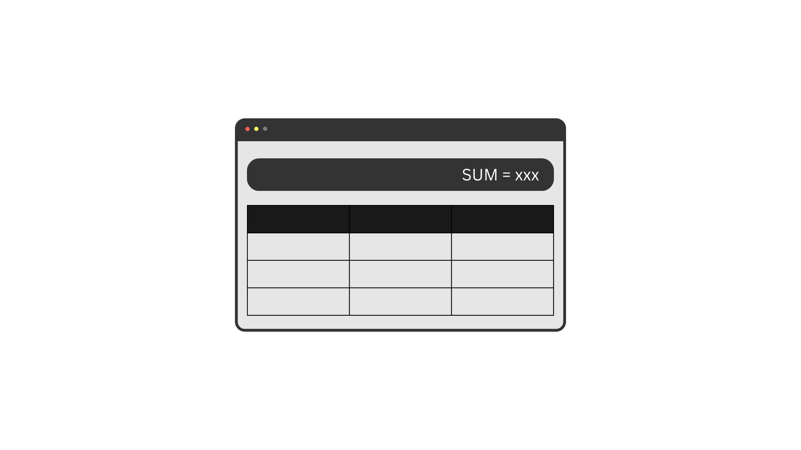

# useQuery()

Inquire status of a query.

## Syntax

```js
const fetchStatus = eq.getQuery(['getTodoItem', 2])
```

## Parameters

### queryKey

The queryKey that used before to invoke an API call by `useQuery()`.

::: tip
getQuery always returns an object. Even if the queryKey is not found.
:::

## Return Value

An object which exposes some information about the query.

## Exposed Data

- **promise:** the promise returned by the query function.
- **options:** the options passed to / set on the query.
- **isLoading:** a boolean indicating whether the query is loading (fetching) for <u>the first time</u>.
- **isFetching:** a boolean indicating whether the query is being fetched.
- **isRetrying:** a boolean indicating whether the query is being retried on failure.
- **isIdle:** a boolean indicating whether the query is idle _(not fetching, not loading, not retrying)_.
- **isFetched:** a boolean indicating whether the query has been fetched successfully at least once.
- **isFailed:** a boolean indicating whether the query has failed in the last time.
- **fetchedAt:** a timestamp indicating when the query was last fetched.
- **failedAt:** a timestamp indicating when the query was last failed.
- **retries:** a number indicating how many times the query has been retried after a failure. It will be reset on success.
- **queryKey:** the query key.
- **queryFn:** the query function.

## Full Example

Assume we have a page with a header and a table of items. The header shows the sum of items in the table. The table shows the list of items.

The table could be a different component, and it is responsible for fetching the list of items.




```js
// a module
import eQuery from 'e-query'

export const eq = new eQuery()
```

```js
// TableComponent
import { eq } from './module'

function getItems() {
    return eq.useQuery('getItems', () => fetch('https://example.com/items'))
}

// at some point of the code
getItems().then(
    // render the list of items
    // save the list of items somewhere (e.g. state management module)
)
```
So we created an instance of e-query and used it to fetch the list of items inside the table component.

Now we want to show the sum in the header. Header is not aware of the status of the table component by default.
We could use `getQuery` to inquire about the status of the table component's query.

```js
// HeaderComponent
import { eq } from './module'
import { data } from './someWhere'

function renderSum() {
    const { isFetched } = eq.getQuery('getItems')
    if (isFetched)
        render(data.sum)
    else
        render('Loading...')
}
```

As you can see we used `getQuery` to inquire about the status of the table component's query. If the query is fetched, we render the sum, otherwise we render a loading message.

Please note that, e-query is not a state management library. So it does not provide a way to share the fetched data between components.
