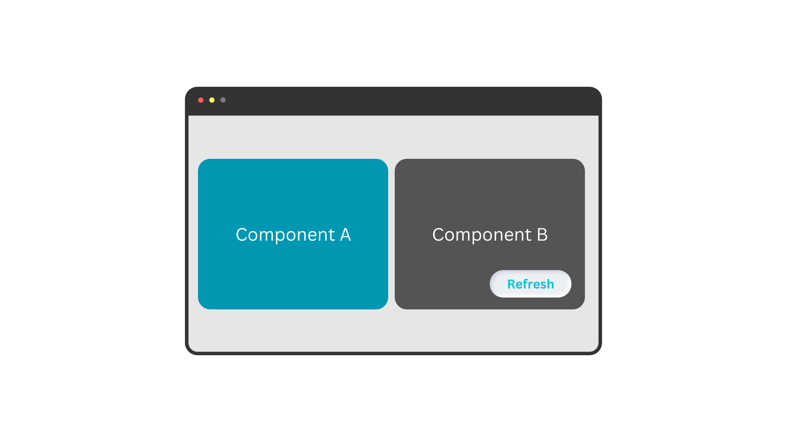

# useQuery()

It is used to invoke an API call.

## Syntax

```js
export function getTodoItem(id, isForce = false) {
    return eq.useQuery(['getTodoItem', id],
        () => fetch('https://jsonplaceholder.typicode.com/todos/' + id),
        {
            force: isForce,
            staleTime: 10 * 1000,
            retry: 3,
            retryDelay: 1000
        })
}

// in another file (e.g. component or module)
getTodoItem(1)
```

## Parameters

### queryKey

A **unique** key for the query. It can be any serializable value *(e.g. String, Number, Array, Object, etc.)*.
When we say unique, we mean that if you pass the same queryKey to multiple useQuery() calls, they will be treated as the same query.

```js
// some examples of queryKey
const queryKey1 = 'getTodoItem'
const queryKey2 = ['getTodoItems', 'yesterday']
const queryKey3 = { type: 'get', time: 'today', items: [1, 2], done: false }
const queryKey4 = { foo: 'bar', count: 24 }
const queryKey5 = { count: 24, foo: 'bar' } // e-query assumes queryKey4 and queryKey5 are the same
```

### queryFn

A function that **returns a Promise**. Usually an API call.

e-query use this promise to determine the status of the query. You may work with any API library you want (e.g. [Axios](https://axios-http.com/docs/intro)) as long as it returns a promise.

Throw an error in your queryFn to make the query fails.
example:
```js
const queryFn = function () {
    return fetch('https://jsonplaceholder.typicode.com/todos/1')
        .then(response => response.json())
        .then(json => {
            if (json.id === 1) {
                return json
            } else {
                throw new Error('invalid id')
            }
        })
}
```

### options

Options let you customize the behavior of queries.

Please refer to [Options](/options) for more information.


## Return Value

It returns the promise returned by the query function.

```js
async function fetchData() {
    console.log('start fetching')
    await eq.useQuery(...args)
    console.log('end fetching')
}
```


## Full Example

Assume we have two components that are used across our project.

Both of them need user profile data from the server. Component A needs that to display user's name, and component B needs that to display user's email.
These components are reused in different pages of our project and do not aware of each other. (They may also have been developed by two different developers.)



We fetch the profile data inside each component on mount. So we have two API calls to the same endpoint.
If we do not manage this situation properly we ends up with two API calls which one of them is totally unnecessary and increases the load on the server.

But we could easily wrap our API call with `useQuery` and let e-query easily manage it for us.

```js
// API Module (could be a state management module)
import eQuery from '@mjkhonline/e-query'

const eq = new eQuery({
    retry: 1,
    distinctRetry: false
})

export function getProfile(id, force = false) {
    return eq.useQuery(['getProfile', id],
        () => fetch('https://example.com/profile/' + id),
        {
            force
        }
    )
}
```

```js
// Component A
import { getProfile } from './api-module'

onMount(async () => {
    const profile = await getProfile(1)
    render(profile.name)
})
```

```js
// Component B
import { getProfile } from './api-module'

onMount(async () => {
    const profile = await getProfile(1)
    render(profile.email)
})

onRefreshButtonClick(() => getProfile(1, true))
```

As you can see both components are mounted at the same time, and as a result both call getProfile to fetch profile from the server. But e-query prevents the second API call and returns the promise of the first call to the second component.

So you don't need to care about how many times and in how many components you call getProfile, e-query handles it for you.

In component B we also have a refresh button. When user clicks on it, we want to refresh the profile data. So we pass `true` as the second argument to `getProfile` to force e-query to make a new API call.
